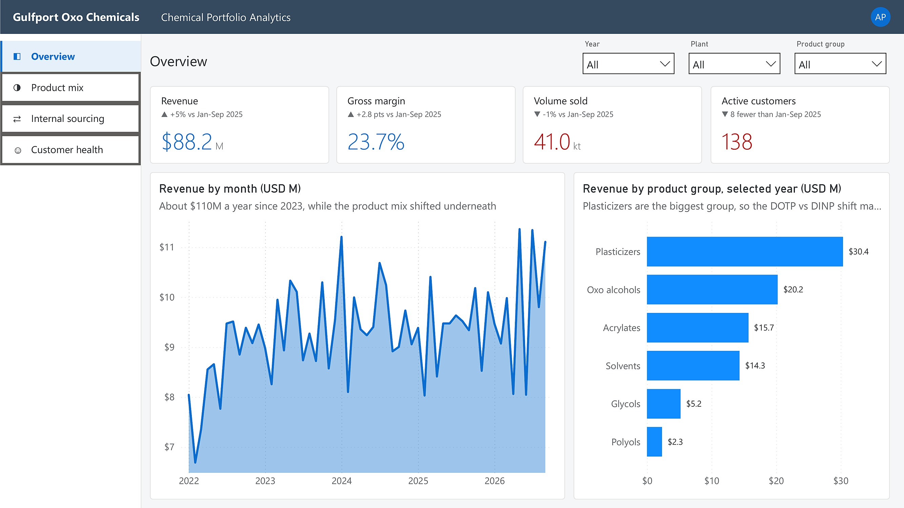
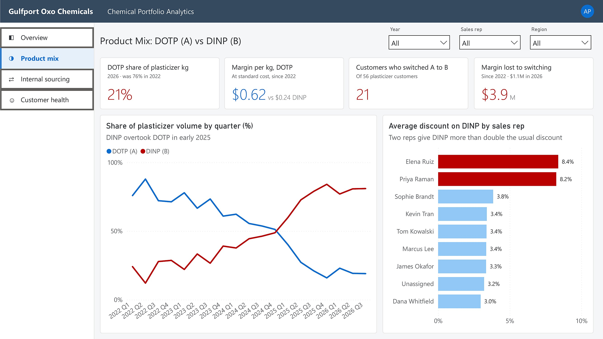
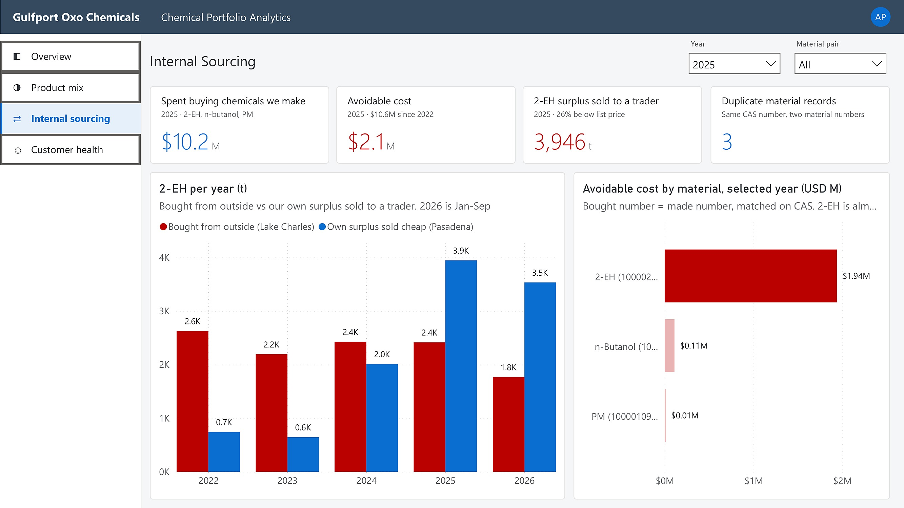
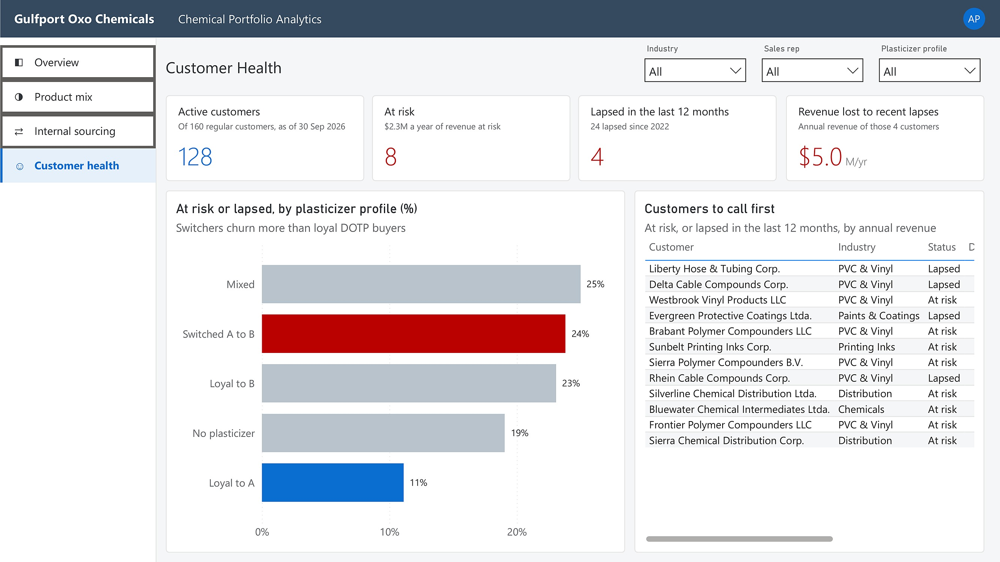

# Dashboard walkthrough

This goes through the report one page at a time: what each page is trying to answer, what the numbers say, and anything that's easy to misread. The screenshots are in [`images/`](../images/) and the full report is in [`dashboard/ProjectC.pdf`](../dashboard/ProjectC.pdf).

## Layout

I styled the report like an SAP Fiori app, since that's what the people using this data would look at every day. Every page has the same layout:

```
+---------------------------------------------------------------------+
| Shell bar: company name and app name                                |
+-------------+-------------------------------------------------------+
| Side menu   | Page title                          Slicers (2 or 3)  |
|             +-------------+-------------+-------------+-------------+
| Overview    | Card 1      | Card 2      | Card 3      | Card 4      |
| Product mix | value, plus a line of context underneath              |
| Internal    +---------------------------+---------------------------+
|  sourcing   | Left: trend over time     | Right: breakdown          |
| Customer    |                           |                           |
|  health     |                           |                           |
+-------------+---------------------------+---------------------------+
```

Each chart has a plain title and a one-line subtitle with the takeaway. Blue means good or neutral, red means the thing to worry about. The Year slicer drives the cards and the right-hand chart. The left-hand chart always shows every year so the trend stays in view.

The side menu is a set of page navigation buttons sitting on an SVG image. In Power BI Desktop you hold Ctrl and click; in the service a normal click works.

Units: M = million US dollars, kt = thousand tonnes, t = tonnes. Margin is gross margin at standard cost. 2026 runs January to September, so the cards compare it with January to September 2025.

---

## 1. Overview



**The question:** how is the business doing overall?
**Slicers:** Year, Plant, Product group.

| Card | Value (2026, Jan-Sep) | What it means |
|---|---|---|
| Revenue | $88.2M, up 5% | Net of returns |
| Gross margin | 23.7%, up 2.8 points | At standard cost. 2023 and 2024 were the low years (about 20%) |
| Volume sold | 41.0 kt, down 1% | |
| Active customers | 138, 8 fewer | Regular customers (so not the spot trader) with at least one order in the period |

**Revenue by month:** about $110M a year since 2023, so the top line looks flat and healthy. That's the point of this page: nothing here would make you look closer, while the product mix underneath has changed a lot.

**Revenue by product group:** plasticizers are the biggest group ($30.4M in 2026), then oxo alcohols ($20.2M), acrylates, solvents, glycols and polyols. Because plasticizers are the biggest slice, the DOTP vs DINP shift on the next page matters most.

---

## 2. Product Mix: DOTP (A) vs DINP (B)



**The question:** is the priority plasticizer losing to the cheaper one, and why?
**Slicers:** Year, Sales rep, Region.

| Card | Value | What it means |
|---|---|---|
| DOTP share of plasticizer kg | 21% in 2026, was 76% in 2022 | Share of DOTP + DINP volume only |
| Margin per kg, DOTP | $0.62 vs $0.24 for DINP | At standard cost, all orders since 2022 |
| Customers who switched A to B | 21 of 55 plasticizer customers | Mostly DOTP in their first 12 months, mostly DINP in their last 12 |
| Margin lost to switching | $3.9M since 2022, $1.1M in 2026 | The DINP those 21 customers bought, times the $0.38/kg margin gap |

**Share of plasticizer volume by quarter:** the two lines cross in early 2025. DINP was already gaining through 2023 and 2024, so a simple monthly mix KPI would have caught it a year or more earlier.

**Average discount on DINP by sales rep:** Elena Ruiz (8.4%) and Priya Raman (8.2%) give more than double the discount everyone else does (3.0% to 3.8%). Those two bars are red. This is the clue that the shift is driven by how DINP is sold, not just by price in the market.

**Easy to misread:** "switched" is about the customer's own mix, not the total. A customer who always bought DINP is "Loyal to B", not a switcher, and isn't counted in the margin lost.

---

## 3. Internal Sourcing



**The question:** how much is the company spending on chemicals it already makes, and how much of that could it have supplied itself?
**Slicers:** Year (starts on 2025), Material pair.

| Card | Value (2025) | What it means |
|---|---|---|
| Spent buying chemicals we make | $10.2M | Purchase orders for 2-EH, n-butanol and PM, the three bought materials whose CAS number matches a material we produce |
| Avoidable cost | $2.1M, $10.6M since 2022 | The part we could have covered from our own surplus and spare stock, times the gap between the purchase price and our own cost plus freight |
| 2-EH surplus sold to a trader | 3,946 t, 26% below list | What Pasadena sold to the spot trader while Lake Charles was buying |
| Duplicate material records | 3 | Pairs of material numbers with the same CAS number, one made and one bought |

**2-EH per year:** red is what Lake Charles bought from outside, blue is what Pasadena sold cheaply to a trader. In 2025 and 2026 the surplus sold off is bigger than what was bought in. The company was selling its own 2-EH at a discount and buying the same chemical back at full price.

**Avoidable cost by material:** 2-EH is $1.94M of the $2.1M in 2025. n-Butanol ($0.11M) and PM ($0.01M) are the same mistake on a smaller scale. Each bar is labelled with both material numbers, bought = made.

**Easy to misread:** "spent" isn't the same as "wasted". Only the avoidable cost is money the company could have kept. The rest was volume Pasadena couldn't have supplied anyway.

---

## 4. Customer Health



**The question:** which customers are slowing down, and who should sales call first?
**Slicers:** Industry, Sales rep, Plasticizer profile.

| Card | Value (as of 30 Sep 2026) | What it means |
|---|---|---|
| Active customers | 128 of 160 regular customers | Ordering at roughly their usual rhythm |
| At risk | 8, with $2.3M a year of revenue | No order for more than twice their usual gap, or their last three gaps running at more than twice their usual |
| Lapsed in the last 12 months | 4 (24 since 2022) | No order for more than three times their usual gap, and at least 120 days |
| Revenue lost to recent lapses | $5.0M a year | Annual revenue of those 4 customers |

**Customers to call first:** every at-risk customer, plus anyone who lapsed in the last 12 months, sorted by revenue. It shows how many days since their last order next to their usual gap, so a rep can see at a glance how far off rhythm they are. This is the list I'd send to sales every Monday.

**At risk or lapsed, by plasticizer profile:** loyal DOTP buyers churn the least (11%). Customers who switched to DINP are at 24%, more than twice that, and they have the highest at-risk rate of any group (14%). This ties the page back to page 2: once a customer starts buying on price, they keep shopping around.

**Easy to misread:** the spot trader and returns are left out, because neither has a normal ordering rhythm. "Usual gap" is the median number of days between that customer's orders, so a weekly buyer and a quarterly buyer are judged against themselves, not against a fixed 90-day rule.
