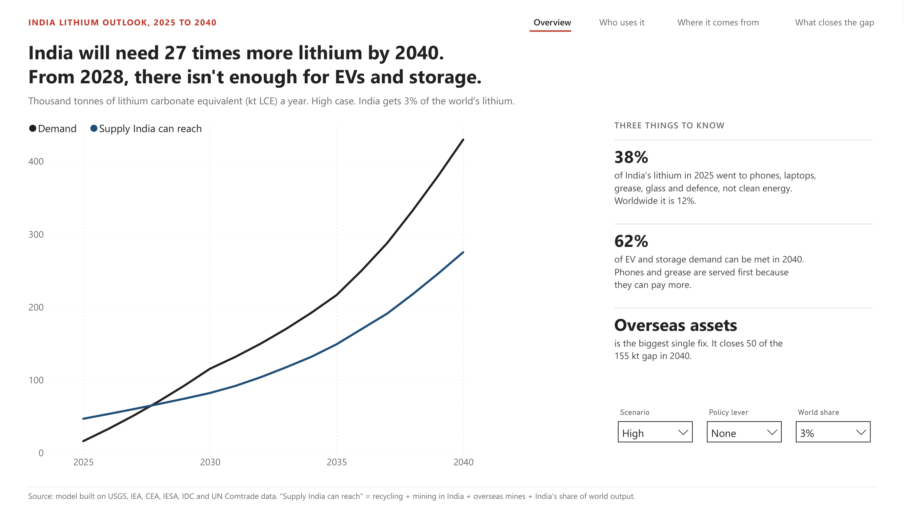
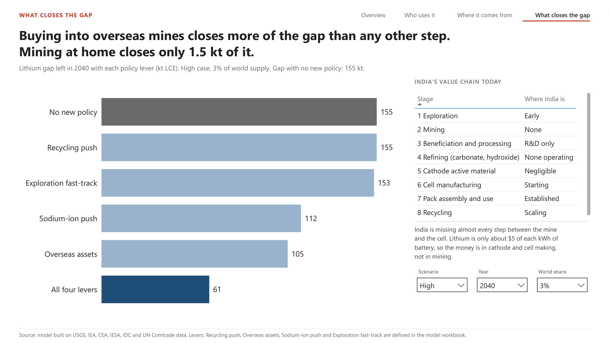

# Competing demand for lithium in India, 2025 to 2040



India's clean energy plans run on lithium-ion batteries, and India mines, refines and makes almost none of the lithium that goes into them. When people talk about this, they usually mean EVs and grid storage. But the same imported cells and chemicals also go into phones, laptops, phones assembled for export, lubricating grease, glass, ceramics, medicines and defence equipment. Those buyers are small, and they will pay almost any price, because lithium is a tiny part of what they sell. So if supply gets tight, they get served first and EVs and storage get what's left.

I wanted to put numbers on that. This project builds India's lithium demand bottom-up for 17 uses from 2025 to 2040, compares it with the supply India can realistically reach, and tests four policy levers against the gap. It ends in a four-page Power BI dashboard and a short policy brief.

The questions:

1. **How much lithium will India need, and for what?** By year, by use and by scenario.
2. **When does supply stop being enough for EVs and storage?** If phones, grease and defence are served first, what share of clean-energy demand can still be met?
3. **What actually closes the gap?** Recycling, overseas mines, sodium-ion batteries or mining at home.

Everything is in tonnes of lithium carbonate equivalent (LCE), the standard unit for comparing lithium in different chemical forms.

## What I found

These are Base case numbers, with India able to buy 3% of the world's lithium supply.

- **Demand grows from about 16 kt LCE in 2025 to 64 kt in 2030, 136 kt in 2035 and 266 kt in 2040.** EVs are 85% of the 2040 figure, and electric cars alone are 106 kt. Grid storage is about 17 kt in 2030 as the CEA build-out lands.
- **Today 38% of India's lithium goes to uses outside the energy transition.** Worldwide that figure is about 12% (USGS). It's high in India because the EV fleet is still small and India assembles a lot of phones. Phones made for export take about 1.2 kt a year, and that lithium leaves the country for good.
- **The gap opens in 2034.** By 2040 the shortfall is 63 kt and only 75% of EV and storage demand can be met. In the High case (NITI Aayog-style EV ambition) the gap opens in 2028 and only 63% is met in 2040. The Low case has no gap.
- **The answer depends a lot on India's share of world supply.** At 2% the gap opens in 2029. At 4% it opens in 2039. At 5% or more the Base case has enough. So the share is the single biggest assumption, and the dashboard lets you change it.
- **Mining at home won't fix it.** At the grade reported in Parliament (583 ppm), the whole Reasi resource holds about 18 kt LCE, roughly seven weeks of 2035 demand. A fast-tracked mine closes 3.4 kt of the 2040 gap.
- **Recycling is the biggest home source, but late.** It supplies 61 kt in 2040 and only 3 kt in 2030, because most batteries sold today retire after 2032. India's own scrap can cover about 5% recycled content in 2030, while the 2022 battery rules ask for 20% by 2030-31.
- **Overseas mines close the most.** Adding 10, 30 and 50 kt a year of equity supply in 2030, 2035 and 2040 closes 50 of the 63 kt gap in 2040. Sodium-ion batteries in two-wheelers, three-wheelers and storage cut demand by 38 kt and close 30 kt. All four levers together close the whole gap.

The policy brief turns these into three recommendations: [docs/policy_brief.pdf](docs/policy_brief.pdf).

## The dashboard

The pictures below show the High case, where the squeeze is sharpest. Each page has one headline that states the finding, one big chart, three things to know, and slicers for the scenario, the policy lever and India's share of world supply. The headline numbers are written by DAX, so they change when you move a slicer.

| Page | What it shows |
|---|---|
| [Overview](images/01_overview.png) | Demand against the supply India can reach, the year the gap opens, and the biggest single fix |
| [Who uses it](images/02_who_uses_it.png) | Share of lithium demand by use from 2025 to 2040, export phones and grease |
| [Where it comes from](images/03_where_it_comes_from.png) | Recycling, mining in India, overseas mines and the import cap, stacked against demand |
| [What closes the gap](images/04_what_closes_the_gap.png) | The gap left in a milestone year with each lever, and where India stands on each step of the value chain |

There's a PDF of all four pages in [dashboard/ProjectI.pdf](dashboard/ProjectI.pdf) if you don't have Power BI. The walkthrough in [docs/dashboard_walkthrough.md](docs/dashboard_walkthrough.md) explains every number on each page.



## Data

All inputs are public. Every number in the model carries a source ID (S01 to S31). Where no public number exists, I made an assumption, labelled it `A00`, and wrote down why.

| Input | Main sources |
|---|---|
| EV sales and base year 2025 | IESA, Vahan (via Autocar Professional), EVreporter, JMK Research |
| Grid storage path | CEA National Electricity Plan 2022-32 |
| Electronics units | IDC (phones, PCs, wearables), ICEA (export phones) |
| Industry uses (grease, glass, pharma) | UN Comtrade via World Bank WITS, India imports of HS 283691 and 282520, 2018 to 2024 |
| Lithium per kWh | Worked out from cathode chemistry (LFP, NMC811, LCO) |
| Reasi and Katghora | Lok Sabha answer of July 2024, auction reporting |
| Recycling | Battery Waste Management Rules 2022, the 2025 recycling incentive scheme |
| World supply | USGS 2026 (290 kt Li in 2025), IEA Global Critical Minerals Outlook |

The raw data needed real cleaning. The trade data had numbers stored as text, world totals mixed in with partner rows, and Ireland reporting "lithium carbonate" at $0.55 a kg every year. The EV sales came from seven sources with 36 different names for six vehicle segments, Indian digit grouping like 20,37,831, and three ways of writing a fiscal year. All of it is logged in `data/clean/DQ_Log.csv` and explained in [docs/data_cleaning.md](docs/data_cleaning.md). The tables are described in [data/README.md](data/README.md).

## How I built it

1. **Collecting.** I read each source and typed the numbers I needed into three raw CSVs exactly as reported (text, units and all), plus a source register. The trade data came from WITS as a download.
2. **Cleaning (Excel and Python).** [excel/Project_I_Data_Cleaning.xlsx](excel/Project_I_Data_Cleaning.xlsx) keeps the raw values in grey columns and does each fix with a formula in a yellow column next to them. A Python script repeats the same cleaning as a cross-check and writes the clean CSVs.
3. **Model (Python and Excel).** The Python model writes demand, supply and the balance for 3 scenarios x 6 lever settings x 16 years. [excel/Project_I_Lithium_Demand_Model.xlsx](excel/Project_I_Lithium_Demand_Model.xlsx) does the same maths in plain formulas: pick a scenario, switch levers on or off and change the world share on the Control tab, and every sheet recalculates. I checked all 18 scenario and lever combinations in the workbook against the Python output. How the model works is in [docs/model_method.md](docs/model_method.md).
4. **Power BI.** Eight tables, measures in four folders and four pages. India's share of world supply is a what-if parameter, so imports, the shortfall and the coverage ratio are recalculated live in DAX rather than read from the CSV. The headlines and side text are SVG images drawn by measures. The report is saved as a PBIP project (plain-text TMDL and JSON), so the model and every visual can be read on GitHub.
5. **Policy brief.** Five pages written for someone who won't open the dashboard.

## Repo layout

```
project-I-lithium-india/
├── images/       one picture per dashboard page
├── dashboard/    ProjectI.pdf and the Power BI project (ProjectI/ProjectI.pbip)
├── data/         raw inputs as reported, cleaned CSVs, data dictionary
├── excel/        the cleaning workbook and the scenario model workbook
├── scripts/      cleaning, model, workbook and Power BI build scripts, in run order
└── docs/         policy brief, model method, data cleaning notes, dashboard walkthrough
```

## Running it yourself

**Just the numbers:** open `excel/Project_I_Lithium_Demand_Model.xlsx` and play with the Control tab. It works in Excel, Google Sheets and LibreOffice.

**The dashboard:** open `dashboard/ProjectI/ProjectI.pbip` in Power BI Desktop, point the `DataFolder` parameter at `data/clean/` and hit Refresh. [HOW_TO_OPEN.md](dashboard/ProjectI/HOW_TO_OPEN.md) has the steps.

**Everything from scratch:** run the five scripts in order. See [scripts/README.md](scripts/README.md).

## Limits worth knowing

- **It's a tonnes model, not a price model.** A real shortfall would show up as higher prices and delayed projects, not empty showrooms.
- **The 3% share of world supply is a stress test, not a forecast.** India uses about 1% of world lithium today and is about 3.5% of world GDP. The results move a lot with this number, which is why it's a slicer.
- **Defence is a labelled guess.** There is no public data, so it's an assumption of 150 t LCE in 2025, growing from there.
- **Cell imports aren't in the trade data by quantity.** Lithium-ion cells (HS 850760) are reported by value and count only, so cell demand is built from vehicles and devices instead.
- **Clay-hosted lithium like Reasi's has never been produced commercially anywhere.** The mining lines are generous, and they still barely matter.
- **The squeeze rule is a simplification.** In real life the split would be set by contracts and prices, not a strict queue. But the direction holds: a phone maker will outbid a scooter maker for the same kilogram.

## What's next

- Add prices: a simple cost curve so the gap shows up in rupees per kWh, not only tonnes.
- Split imports by form (ore, chemical, cathode, cell) to show where refining in India would change the import bill.
