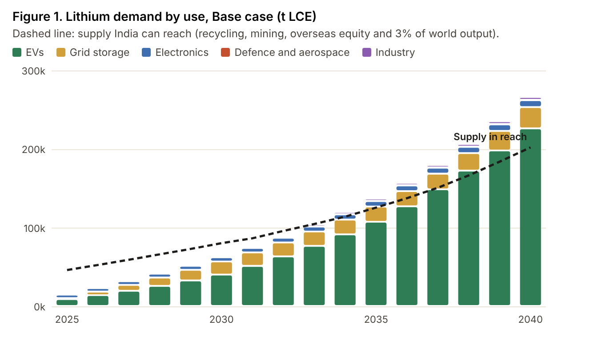
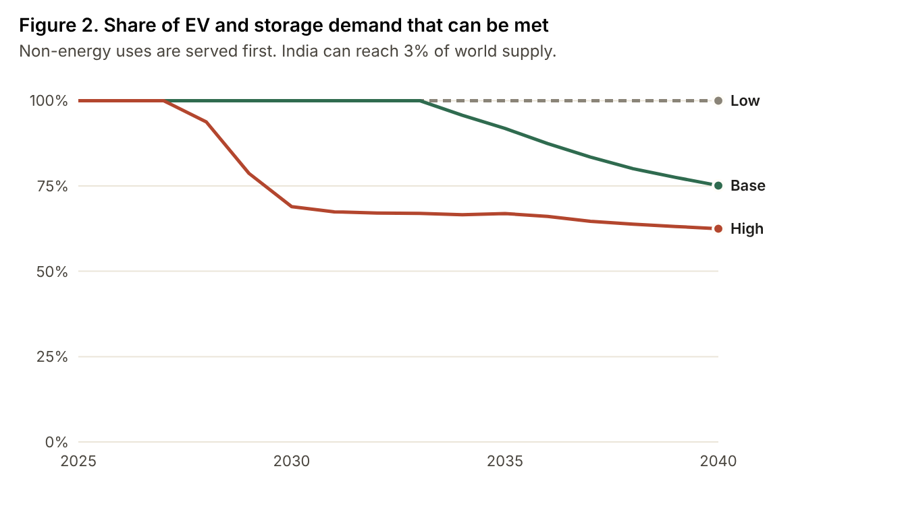
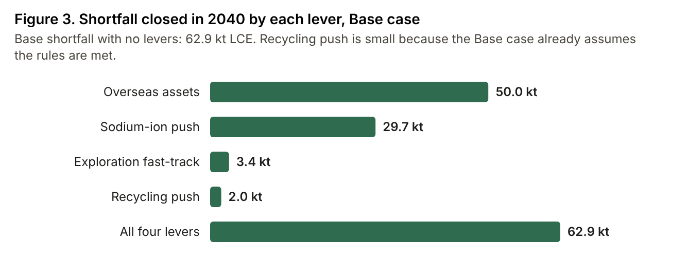

## Summary

India's clean energy plans run on lithium, and India makes almost none of it. Policy talks about EVs and grid storage, but lithium also goes into phones, laptops, phones assembled for export, lubricating grease, glass, ceramics, medicines and defence equipment. These buyers are small, but they pay almost any price, so they get served first. EVs and storage get whatever is left.

I built a bottom-up model of India's lithium demand from 2025 to 2040 across 17 uses and compared it with the supply India can realistically reach. The model has three adoption scenarios and four policy levers, and every input is tied to a public source or a stated assumption.

**Key findings (Base case)**

1. Demand grows from about **16 kt of lithium carbonate equivalent (LCE) in 2025 to 64 kt in 2030, 136 kt in 2035 and 266 kt in 2040**. EVs are 85% of the 2040 figure.
2. Today **38% of India's lithium goes to uses outside the energy transition**, compared with 12% worldwide. Most of it goes to consumer electronics and phones made for export.
3. If India can reach 3% of world lithium supply, a **shortfall appears in 2034**. By 2040, **a quarter of EV and storage demand cannot be met**. In the High case the gap opens in 2028.
4. Domestic mining will not close this gap. At the official grade of 583 ppm, the **entire Reasi resource contains about 18 kt LCE, roughly 1.6 months of India's 2035 demand**.
5. The 2022 battery rules require 20% recycled content in new batteries by 2030-31. **Domestic scrap can cover only about 5% in 2030**, because most of today's batteries retire after 2032.

**Recommendations**

1. Secure 50 kt LCE a year of overseas supply by 2040 through equity and long-term offtake. In the model, this lever does the most on its own.
2. Make sodium-ion the default for two- and three-wheelers and grid storage wherever it fits.
3. Build collection now and phase the recycled-content mandate to match when batteries actually retire.

## 1. Why this matters

India has committed to 500 GW of non-fossil capacity by 2030, an EV push across every vehicle segment, and battery storage of 236 GWh by 2031-32 under the CEA's National Electricity Plan. All three depend on lithium-ion batteries. Today India has:

- **no operating lithium mine.** The Salal-Haimana block in Reasi failed to attract bidders, and the only awarded lithium block (Katghora, Chhattisgarh) is at the composite licence stage;
- **no commercial refining.** Lithium carbonate and hydroxide are all imported, about 2-3 kt LCE a year;
- **almost no cathode or cell production.** Only 1.4 GWh of the 50 GWh ACC PLI target was commissioned by October 2025, and cell import dependence is close to 100% (IEEFA, 2026).

Nearly every link in the chain, from mine to cell, sits outside India. Policy debate treats lithium as an EV and storage issue, but the same imported cells and chemicals also serve electronics, industry and defence. There has been no India-specific estimate of how demand splits across these uses, or of where the gap will hit first.

## 2. How the model works

Demand is built bottom-up for each use and converted to tonnes of LCE.

- **EVs (six segments):** vehicle market × EV share × lithium-ion share × kWh per vehicle × lithium per kWh. The 2025 base comes from IESA (2.6 million EVs, 19 GWh). Pack sizes are calibrated so that each segment's share of GWh matches what IESA reported.
- **Grid storage:** new GWh each year from the CEA storage path, plus replacement of 12-year-old systems.
- **Electronics:** IDC unit sales (152 million phones, 15.9 million PCs, 114 million wearables in 2025) × Wh per device. Phones assembled for export are a separate line, estimated from ICEA export values.
- **Industry:** UN Comtrade imports of lithium carbonate and hydroxide, after cleaning. Grease is cross-checked against an industry survey, and the two agree within 5%.
- **Defence and aerospace:** no public data exists, so this is a labelled estimate of 150 t LCE in 2025.

Lithium per kWh is worked out from cathode chemistry: about 0.51 kg LCE per kWh for LFP, 0.59 for NMC811 and 0.66 for LCO. These figures include electrolyte salt and manufacturing scrap. Sodium-ion cells use no lithium.

Supply has four parts: recycling of retired batteries, domestic mining, overseas equity (KABIL) and open-market imports. Open-market imports are capped at India's share of world supply. World supply starts at 290 kt of lithium in 2025 (USGS) and roughly triples by 2040, in line with IEA projections. The model treats India's accessible share as a stress test, set at 3% in the Base case. India uses about 1% of world lithium today and accounts for about 3.5% of world GDP.

**The squeeze rule.** When supply is short, non-energy uses are served first. A phone maker or grease blender spends a tiny share of product cost on lithium and will outbid an EV maker, for whom the battery is a large share of the vehicle cost. The output that matters is the share of EV and storage demand that can still be met.

The three scenarios (Low, Base, High) change EV adoption, the storage build-out, electronics growth, recycling performance, and the timing of mines and overseas projects. High follows the NITI Aayog 2030 ambition of 80% EV sales in two- and three-wheelers and 30% in private cars.

## 3. Findings

**Demand grows sixteen-fold, and EVs dominate after 2030.** In the Base case demand reaches 266 kt LCE in 2040, about 6% of world supply that year. Electric cars are the biggest single use at 106 kt LCE. Two-wheelers come next because of their volume, even with packs of about 3.5 kWh. Storage rises sharply as the CEA build-out lands: about 17 kt LCE in 2030 alone.

**Non-energy uses are bigger than most people assume.** In 2025 phones sold in India, phones made for export, power banks, laptops, grease, glass, ceramics, medicines and defence took about 6 kt LCE, 38% of the total. Two parts of this are worth noting:

- **Export assembly.** Phones assembled in India for export pull about 1.2 kt LCE a year in imported cells. That lithium leaves the country, so it never comes back for recycling.
- **Lubricating grease.** Grease uses about 1.1 kt LCE of lithium hydroxide a year. In 2023, 77% of that hydroxide by value came from Russia, which makes it a supply-risk issue as well as a demand one.

**Once supply is tight, clean energy loses.** At a 3% accessible share, the Base case has enough lithium until 2033. After that, demand outgrows supply:

| | 2030 | 2035 | 2040 |
|---|---|---|---|
| Demand (kt LCE) | 64 | 136 | 266 |
| Supply in reach (kt LCE) | 81 | 126 | 203 |
| Shortfall (kt LCE) | 0 | 10 | 63 |
| EV and storage demand met | 100% | 92% | 75% |
| Import dependence | 95% | 87% | 77% |

The result depends on the accessible share. At 2%, the shortfall starts in 2029 and only 58% of EV and storage demand is met in 2040. At 4%, it starts in 2039. At 5% or more, the Base case has no gap. In the High case a gap appears even at 6%.

**Domestic mining is not the answer before 2040.** The Lok Sabha answer of July 2024 puts Reasi at 5.9 Mt of inferred (G3) ore at 583 ppm lithium, hosted in bauxite. That works out to about 3,400 t of lithium metal, or 18,300 t LCE, before any processing losses. Hard-rock spodumene ore runs at about 5,800 ppm and brines at 200-2,000 ppm (CEEW, 2025). Clay-hosted lithium has not yet been produced commercially anywhere. The IEA puts the average lead time from discovery to first production at more than 16 years, which points to the late 2030s even if the block is awarded soon. A fast-track lever, with mining from 2032 and 4 kt LCE a year by 2040, closes only 3.4 kt of the 2040 gap.

**Recycling matters, but later than the rules assume.** Under the Base assumptions, recycling supplies 61 kt LCE in 2040, 23% of demand, and is the biggest domestic source by far. But only 3 kt is available in 2030, because the batteries that retire then were sold when EV sales were small. If collection stays at the Low-case rates, the 2040 shortfall rises from 63 kt to 80 kt.

## 4. Recommendations

### 1. Secure 50 kt LCE a year of overseas supply by 2040

In the model, adding 10, 30 and 50 kt LCE of equity supply in 2030, 2035 and 2040 closes 50 kt of the 63 kt Base shortfall in 2040 and the whole 2035 gap. No other single lever does as much.

- Move KABIL from exploration of 5 Catamarca blocks (15,703 ha, first output targeted for December 2030) to a portfolio of producing assets. Buying minority stakes in projects close to production in Argentina, Chile and Australia is faster than taking greenfield exploration risk.
- Pair equity with long-term offtake contracts under the India-Australia critical minerals partnership and the Minerals Security Partnership.
- Use part of the National Critical Mineral Mission's Rs 34,300 crore for a strategic lithium stockpile. The 2022 price spike (from $11,700/t in 2021 to $63,700/t in 2022, USGS) shows what a stockpile buys time against.
- Process the imported concentrate in India. Refining does not add tonnes, but it moves the value-adding steps onshore and feeds cathode makers.

### 2. Make sodium-ion the default for two-wheelers, three-wheelers and storage where it fits

Raising the sodium-ion share in these segments by 15, 30 and 40 points by 2030, 2035 and 2040 cuts 2040 demand by 38 kt LCE and closes 30 kt of the gap. Unlike the supply levers, it works from the first year, because it reduces demand directly.

- Write SECI and state storage tenders as technology-neutral, with requirements set on duration, cycle life and safety rather than chemistry.
- Allow sodium-ion and other low-lithium chemistries in the next round of ACC PLI bids.
- Ask BIS to publish sodium-ion cell standards early, so e-rickshaw and low-speed two-wheeler makers can switch from lead-acid straight to sodium-ion.

### 3. Build collection now and phase the recycled-content mandate to match retirements

Recycling becomes India's biggest domestic source of lithium in the late 2030s, but only if collection systems are in place before the large retirement wave.

- Enforce EPR collection targets with a battery passport, so every pack sold can be traced to a registered recycler. The informal sector handles most e-waste today, which is why electronics collection starts low in the model.
- Phase the recycled-content mandate to the retirement curve rather than a fixed 20% by 2030-31. Domestic scrap supports about 5% in 2030 and 14% in 2035. Otherwise, either allow imported black mass to count or expect the mandate to be met on paper only.
- Bring scrap from phone and cell factories into the Rs 1,500 crore recycling incentive scheme. The scheme targets 270 kt a year of recycling capacity by 2031.

## 5. What the model does not do

- **Prices.** The model works in tonnes and does not forecast prices. A shortfall would show up as higher costs and delayed projects, not as empty showrooms.
- **Defence.** Defence demand is an assumption band, since no public data exists.
- **Accessible share of world supply.** The 3% share is a stress test, not a forecast. The workbook lets you change it.
- **Cell import data.** Trade data for lithium-ion cells (HS 850760) was not available by quantity. Cell demand is modelled from vehicle and device numbers instead.
- **Clay ore processing.** Recovery from clay-hosted ore like Reasi's is unproven. The mining lines assume production only in the Base and High cases.

## Sources

USGS Mineral Commodity Summaries 2026 (lithium); Lok Sabha Unstarred Question 267 (24 July 2024); CEEW, *Making India a Hub for Critical Minerals Processing* (2025); CEEW, CSEP, ICRIER, IISD and Shakti, *State of the Sector: Critical Energy Transition Minerals for India*, Vol. I and II (2025); World Bank WITS / UN Comtrade (HS 283691, 282520); IESA, JMK Research, EVreporter and Autocar Professional (Vahan data); CEA National Electricity Plan 2022-32; IDC India (smartphones, PCs, wearables); ICEA; IEEFA, *Assessing India's ACC PLI scheme* (2026); Battery Waste Management Rules 2022; Cabinet decision on the critical mineral recycling scheme (September 2025); IEA Global Critical Minerals Outlook 2025 and 2026; IEA Critical Minerals Policy Tracker; NITI Aayog and RMI (2019); NLGI grease survey via Lubes'n'Greases; WRI India (e-rickshaw batteries). The full register with links is in the model workbook.
