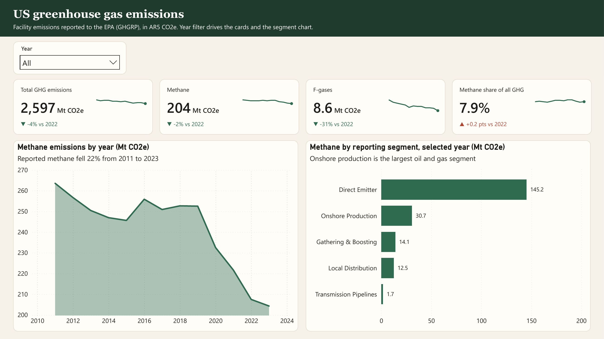
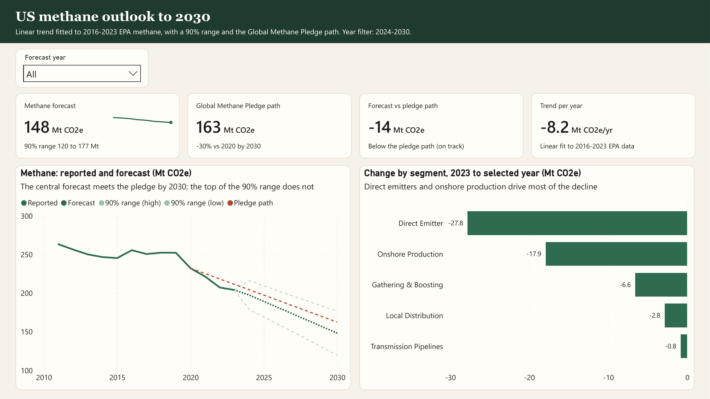
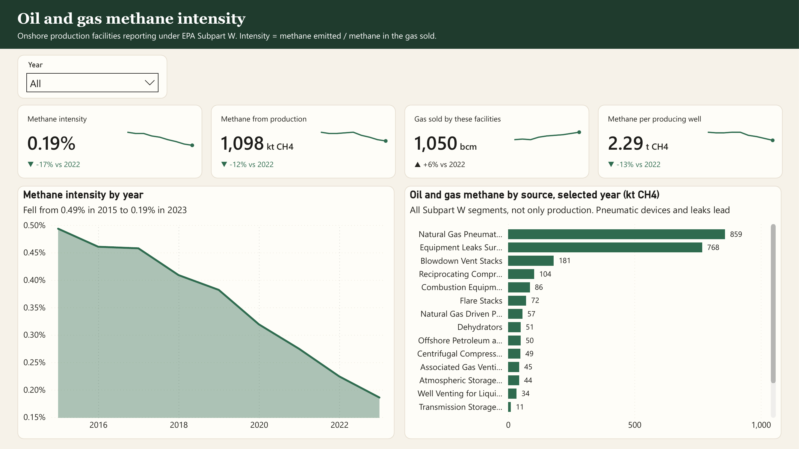
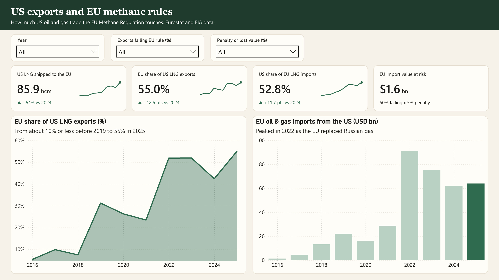
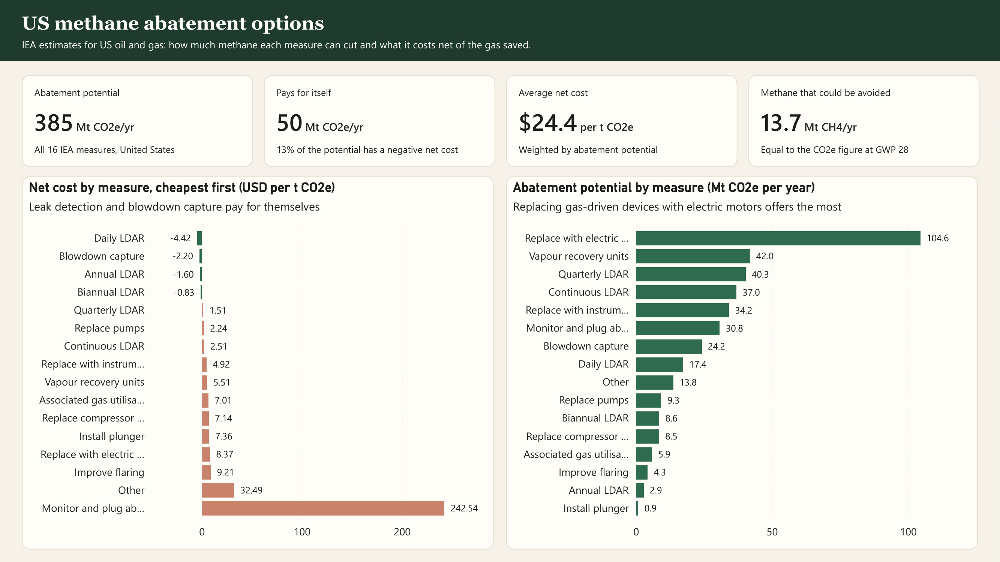
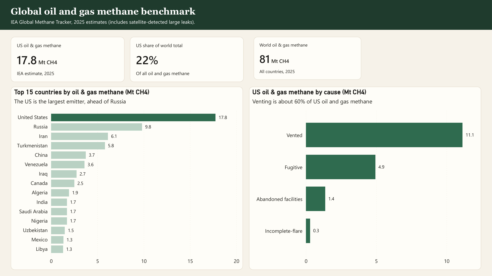

# Dashboard walkthrough

This goes through the report one page at a time: what each page is trying to answer, what the numbers say, and anything that's easy to misread. The screenshots are in [`images/`](../images/) and the full report is in [`dashboard/ProjectL.pdf`](../dashboard/ProjectL.pdf).

## Layout

Every page uses the same layout, so once you've read one you can read them all:

```
+--------------------------------------------------------------+
| Title, plus a line on where the data comes from              |
+--------------------------------------------------------------+
| Slicers: year, forecast year, or scenario inputs             |
+--------------+--------------+--------------+-----------------+
| Card 1       | Card 2       | Card 3       | Card 4          |
| value, change vs the year before, small trend line           |
+--------------+--------------+--------------+-----------------+
| Left: trend over time        | Right: breakdown by category   |
+------------------------------+--------------------------------+
```

Each chart has a plain title plus a one-line subtitle that gives the takeaway. On page 1, for example, "Methane emissions by year" comes with "Reported methane fell 22% from 2011 to 2023".

Units used throughout: Mt = million tonnes, kt = thousand tonnes, CO2e uses IPCC AR5 values (methane = 28), bcm = billion cubic metres.

---

## 1. US greenhouse gas emissions



**The question:** how much do US facilities emit, and how much of that is methane and F-gas?
**Data:** EPA Greenhouse Gas Reporting Program, facility level, 2011-2023.

| Card | Value | What it means |
|---|---|---|
| Total GHG | 2,597 Mt CO2e, down 4% on 2022 | Every gas from every reporting facility in 2023 |
| Methane | 204 Mt CO2e, down 2% | |
| F-gases | 8.6 Mt CO2e, down 31% | HFCs, PFCs, SF6 and NF3. Much of the drop is HFC-23 at two Chemours plants (Louisville -1.7 Mt, Washington Works -0.65 Mt), in line with the AIM Act |
| Methane share | 7.9%, up 0.2 points | Methane is falling, just more slowly than everything else |

- **Left:** reported methane fell 22%, from about 265 Mt in 2011 to 204 Mt in 2023. Most of that drop came after 2019.
- **Right:** in 2023, direct emitters (landfills, coal mines, chemical plants and so on) made up 145 Mt. Within oil and gas, onshore production is the biggest segment at 30.7 Mt, followed by gathering and boosting (14.1), local distribution (12.5) and transmission pipelines (1.7).

With the year slicer on "All", the cards show 2023 against 2022.

---

## 2. US methane outlook to 2030



**The question:** if the recent trend carries on, does the US meet the Global Methane Pledge (30% below 2020 by 2030)?
**Model:** a straight-line trend fitted to 2016-2023 and projected to 2030, with a 90% range. The method is in [forecast_model.md](forecast_model.md).

| Card | Value | What it means |
|---|---|---|
| Methane forecast | 148 Mt CO2e in 2030 (90% range 120-177) | Central projection |
| Pledge path | 163 Mt CO2e | 2020 level × 0.70 |
| Forecast vs pledge | -14 Mt CO2e | Negative means below the pledge line |
| Trend | -8.2 Mt CO2e a year | Slope of the fitted line |

- **Left:** solid line is reported data, dotted is the forecast, the light dashed lines are the 90% range and the red dashed line is the pledge path. The central forecast gets there by 2030, but the top of the range (177 Mt) doesn't. So it's likely, not certain.
- **Right:** most of the projected fall comes from direct emitters (-27.8 Mt) and onshore production (-17.9 Mt). Gathering and boosting (-6.6), local distribution (-2.8) and transmission (-0.8) add little.

A straight line assumes the 2016-2023 pace simply continues. It doesn't know about new rules like EPA's methane fee or OOOOb/c, or about changes in production.

---

## 3. Oil and gas methane intensity



**The question:** is US gas getting cleaner per unit produced?
**Data:** EPA Subpart W onshore production facilities. Intensity = methane emitted ÷ methane contained in the gas sold. That's the same definition OGMP 2.0 and the EU Methane Regulation use.

| Card | Value | What it means |
|---|---|---|
| Methane intensity | 0.19%, down 17% | 0.19 kg lost for every 100 kg of methane sold |
| Methane from production | 1,098 kt CH4, down 12% | Emissions are falling... |
| Gas sold | 1,050 bcm, up 6% | ...while output grows, so intensity falls faster than emissions |
| Methane per producing well | 2.29 t CH4, down 13% | |

- **Left:** intensity fell from 0.49% in 2015 to 0.19% in 2023. That's under the 0.2% the Oil and Gas Climate Initiative set as its 2025 target. Methane fell 42% over the period while gas sold rose 55%, so both sides of the ratio helped.
- **Right:** in 2023, pneumatic devices (859 kt) and equipment leaks (768 kt) are far ahead of everything else. Blowdowns (181 kt) and reciprocating compressors (104 kt) come next. These two big sources are exactly what the cheapest fixes on page 5 go after.

One thing to watch: the right chart covers every Subpart W segment, not just production, so its bars add up to about 2,415 kt. That's more than the 1,098 kt production card. The chart subtitle says so.

---

## 4. US exports and EU methane rules



**The question:** how much US trade does the EU Methane Regulation (EU 2024/1787) touch, and what could it cost? The import requirements start phasing in from 2027.
**Data:** Eurostat EU imports from the US, and EIA US LNG exports by destination.

| Card | Value | What it means |
|---|---|---|
| US LNG to the EU | 85.9 bcm in 2025, up 64% | Volume covered by the rule |
| EU share of US LNG | 55.0%, up 12.6 points | More than half of US LNG goes to the EU |
| US share of EU LNG imports | 52.8%, up 11.7 points | And the EU relies on the US just as much |
| EU import value at risk | $1.6 bn | Scenario: 50% of trade fails the rule × 5% penalty or lost value |

- **The two scenario dropdowns** ("Exports failing EU rule %" and "Penalty or lost value %") are what-if parameters. The at-risk card recalculates when you change them. The defaults are 50% and 5%, and they're my assumptions, not anyone's forecast.
- **Left:** the EU's share of US LNG was around 10% or less before 2019 and reached 55% in 2025.
- **Right:** EU oil and gas imports from the US peaked at about $92 bn in 2022, when Europe was replacing Russian pipeline gas, then settled around $60-65 bn. The latest year ($64 bn in 2025) is the dark green bar.

---

## 5. US methane abatement options



**The question:** which measures cut the most methane, and which ones pay for themselves?
**Data:** IEA estimates for 16 measures in US oil and gas. Net cost is the cost of the measure minus the value of the gas it saves.

| Card | Value | What it means |
|---|---|---|
| Abatement potential | 385 Mt CO2e a year | All 16 measures together |
| Pays for itself | 50 Mt CO2e a year | 13% of the potential has a negative net cost |
| Average net cost | $24.4 per t CO2e | Weighted by potential |
| Methane avoided | 13.7 Mt CH4 a year | 385 ÷ 28 |

- **Left, cheapest first:** daily leak detection and repair (-$4.42/t), blowdown capture (-$2.20), annual LDAR (-$1.60) and twice-yearly LDAR (-$0.83) all have negative cost, meaning the gas they save is worth more than they cost. Most of the rest sit between $1.5 and $9 a tonne. Monitoring and plugging abandoned wells is the outlier at $242.54.
- **Right, biggest first:** replacing gas-driven devices with electric motors is the biggest single cut (104.6 Mt CO2e a year), then vapour recovery units (42.0) and quarterly LDAR (40.3).

Put pages 3 and 5 together and the story is simple: the biggest sources (pneumatics and leaks) line up with the biggest and cheapest fixes (electric devices and LDAR).

---

## 6. Global oil and gas methane benchmark



**The question:** how does the US compare with other countries?
**Data:** IEA Global Methane Tracker, 2025 estimates, including large leaks picked up by satellite.

| Card | Value |
|---|---|
| US oil and gas methane | 17.8 Mt CH4 |
| US share of world | 22% |
| World oil and gas methane | 81 Mt CH4 |

- **Left, top 15 countries:** the US is the biggest oil and gas methane emitter at 17.8 Mt, ahead of Russia (9.8), Iran (6.1) and Turkmenistan (5.8).
- **Right, US by cause:** venting 11.1 Mt (about 60%), fugitive 4.9, abandoned facilities 1.4, incomplete flaring 0.3.

**Why this doesn't match page 1.** The IEA's 17.8 Mt CH4 is roughly 8 times what GHGRP facilities report for oil and gas (about 59 Mt CO2e, or 2.1 Mt CH4). There are two reasons. GHGRP only covers facilities above its reporting threshold, and EPA's own national inventory is already several times larger than GHGRP. On top of that, reported figures use engineering estimates, while the IEA adds measurement and satellite data (0.77 Mt of the US total is satellite-detected super-emitters). Pages 1 to 3 use the EPA basis and pages 5 and 6 use the IEA basis. I don't combine the two in any one number.

---

## Checking the numbers

I recalculated every figure on all six pages straight from the CSVs with a separate script, without going through Power BI. They all match the report to the rounding shown. A few that are worth knowing in more detail:

| Page | Recalculated | Comment |
|---|---|---|
| 1 | Total 2,596.7, methane 204.3, F-gas 8.62 Mt CO2e; methane -22.5% since 2011 | HFC/PFC mixtures stay in AR4 because EPA only reports them as CO2e |
| 2 | Slope -8.22, 2030 = 148.4, range 119.7-177.1, R² 0.89; pledge 162.8 | Segment forecasts add up to the total. Onshore production falls 58% by 2030 on a straight line, which is optimistic |
| 3 | Intensity 0.494% to 0.186%; 1,098 kt; 1,050 bcm; 2.29 t per well | |
| 4 | LNG to EU 85.9 bcm, 55.0%; US share of EU LNG 52.8%; imports $64.0 bn; 64.0 × 50% × 5% = $1.6 bn | Consistent with EIA's total of about 156 bcm of US LNG exports in 2025 |
| 5 | 384.5 Mt CO2e, 13.73 Mt CH4, 50.2 Mt pays for itself (13%), $24.37/t | Potential is 77% of the IEA US estimate, close to the IEA's own "about 75% is avoidable" |
| 6 | US 17.75 Mt, world 81.0 Mt, 21.9%; vented 11.14, fugitive 4.94, abandoned 1.37, flaring 0.30 | |

## The short version

US reported methane fell 22% between 2011 and 2023. A straight-line trend puts it at 148 Mt CO2e in 2030, under the Global Methane Pledge path, though the top of the 90% range isn't. Gas production is getting cleaner per unit (intensity down from 0.49% to 0.19%), but the IEA's satellite-backed estimates show US oil and gas methane is far higher than reported, and the highest of any country. That matters for trade. The EU now takes 55% of US LNG, and on my assumptions its Methane Regulation puts about $1.6 bn of import value at risk. The fixes are well known and cheap: leak detection and blowdown capture pay for themselves, and switching to electric pneumatic devices is the biggest single cut.
